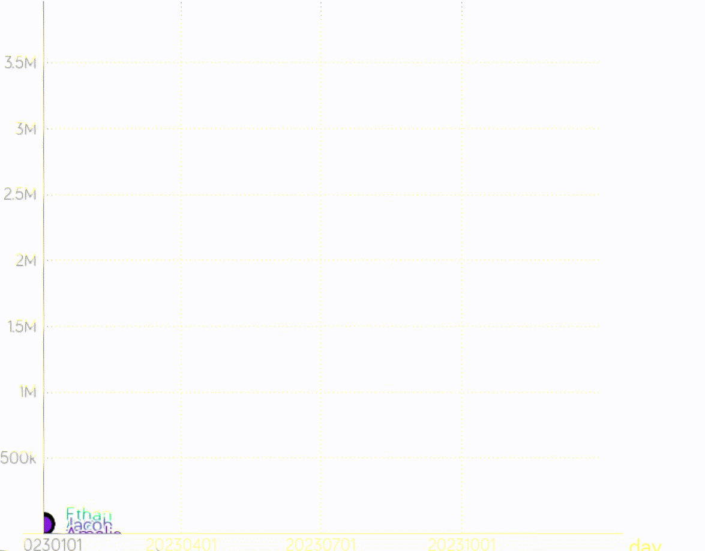

# Garmin steps leaderboard for gapminder

Download and transform garmin leaderboard data and transform for display in gapminder.

Remember to run the program regularly to download the stats to a local .csv file, since garmin only share 6 months of activity data.

1) Download garmin data using leaderboard.py
 
2) Use https://www.gapminder.org/tools 

3) load presets using garmin-gapminder.gmstat

